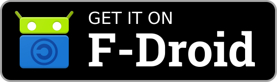

# Домашняя аптечка

Домашняя аптечка — это приложение, предназначенное для удобного хранения и управления вашими лекарствами.

 

# Описание

Приложение предоставляет возможность контролировать сроки годности лекарств, составлять график их приёма и получать напоминания. 
Это незаменимый помощник, который поможет вам быть в курсе вашего здоровья.

# Основные функции

:white_check_mark: Автоматическое добавление лекарств с помощью сканирования кодов.\
:white_check_mark: Облачная синхронизация списка лекарств.\
:white_check_mark: Возможность ручного добавления лекарств.\
:white_check_mark: Обновление информации о лекарстве, если сканирование проводилось без подключения к интернету.\
:white_check_mark: Добавление изображений лекарств.\
:white_check_mark: Сортировка лекарств по срокам годности.\
:white_check_mark: Группировка лекарств по категориям.\
:white_check_mark: Звуковое уведомление о необходимости принять лекарство.\
:white_check_mark: Отображение ближайшего расписания приёма лекарств.\
:white_check_mark: Напоминание об истечении срока годности лекарств.\
:white_check_mark: Возможность экспорта и импорта базы данных на другие устройства.

# Medkit (English)

The application provides the ability to monitor the expiration dates of medicines, schedule their intake and receive reminders.
It is an indispensable assistant that will help you keep abreast of your health.

# Main features

:white_check_mark: Automatically add medications by scanning codes.\
:white_check_mark: Cloud synchronization of the list of medicines.\
:white_check_mark: The ability to manually add medications.\
:white_check_mark: Updating the information about the medicine if the scan was performed without an internet connection.\
:white_check_mark: Adding images of medicines.\
:white_check_mark: Sorting medicines by expiration date.\
:white_check_mark: Grouping medicines by category.\
:white_check_mark: An audible notification about the need for medication.\
:white_check_mark: Displays the nearest medication schedule.\
:white_check_mark: Reminder of the expiration date of medicines.\
:white_check_mark: The ability to export and import databases to other devices.

# Translations

